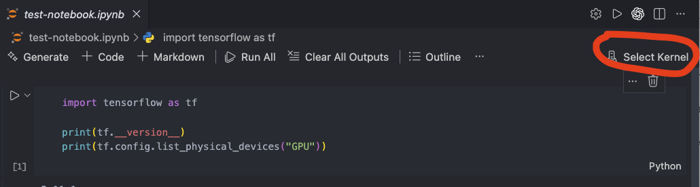
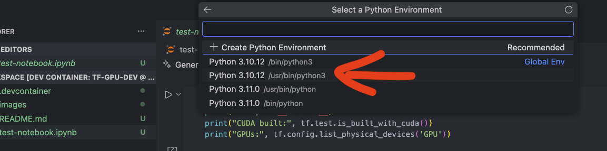
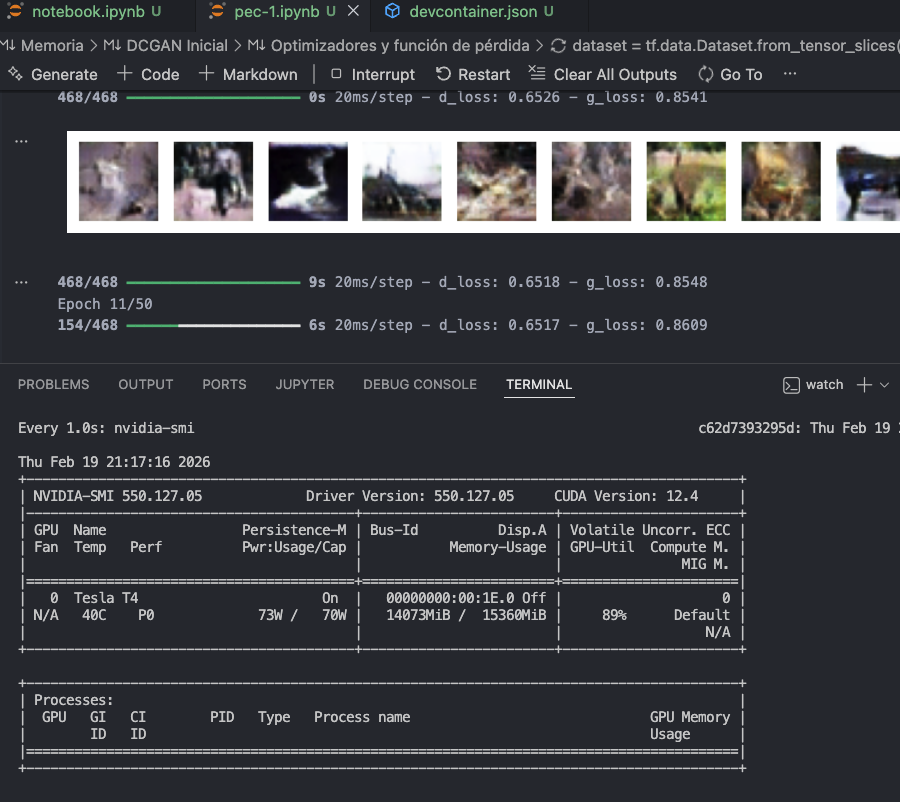

# Tensorflow con y sin GPU (NVIDIA) - Entorno contenerizado y usable desde Visual Studio Code Dev Containers

Entorno reproducible para prácticas de Deep Learning con TensorFlow + GPU NVIDIA (si se tiene) usando:
* Docker
* Dev Containers
* Visual Studio Code
* CUDA (si se tiene GPU NVIDIA)

Este repositorio permite desarrollar notebooks y aprovechar la aceleración GPU, si se tiene, en:
* Linux con (o sin) NVIDIA
* Windows con (o sin) NVIDIA  (WSL2 recomendado)
* EC2 con GPU NVIDIA (mínimo g4dn.xlarge y una AMI Ubuntu 22.04 con soporte GPU o similar)

El entorno está completamente contenerizado y no depende del Python del sistema.

## Objetivo

Proporcionar:
* Entorno reproducible
* Aceleración CUDA real si se dispone del hardware
* Compatible con VSCode Dev Containers (el desarrollador utiliza VSCode en el host pero la ejecución ocurre dentro del contenedor)
* Independiente del sistema operativo host

## Requisitos del Host

### Hardware

* 8GB de RAM mínimo (16 GB recomendado)
* Si se quiere aceleración GPU: GPU NVIDIA compatible con CUDA (Compute Capability >= 7.0 recomendado)

### Sistema Operativo

**Linux (recomendado)**

Ubuntu 20.04/22.04

**Windows**

* Windows 11
* WSL2
* Para aceleración gráfica: Drivers NVIDIA compatibles con CUDA

### Software necesario

#### **Docker**
```bash
docker --version
```
#### **NVIDIA Container Toolkit** (si se tiene GPU NVIDIA)

Este paso es **imprescindible** para que Docker pueda exponer la GPU al contenedor.

Comprobar:
```bash
docker run --rm --gpus all nvidia/cuda:12.4.1-base-ubuntu22.04 nvidia-smi
```
Si aparece la GPU, todo correcto. Si no, hay que instalar como se indica [aquí](https://docs.nvidia.com/datacenter/cloud-native/container-toolkit/install-guide.html)

#### **Visual Studio Code**

Extensiones necesarias:
* `ms-python.python`
* `ms-toolsai.jupyter`

## Cómo funciona el entorno

El proyecto usa:
```
.devcontainer/devcontainer.json
.devcontainer/Dockerfile
```
VSCode:
1. Construye la imagen Docker
2. Lanza el contenedor con la siguiente opción si detecta la GPU:
```
--gpus all
```
3. Monta el directorio de tu copia local del repo en `/workspace` dentro del contenedor

El fichero `Dockerfile` crea un contenedor con las versión de tensorflow para gpu y todas las dependencias necesarias pero si no hay GPU utiliza las versiones para CPU.

## Uso del entorno

### 1. Clona este repositorio

```bash
git clone https://github.com/jolmedilla/tensorflow-env-gpu-dev.git
cd tensorflow-env-gpu-dev
```

### 2. Abre VSCode
```bash
code .
```

### 3. Reabre en Dev Container
Desde VS Code:
1. Ctrl + Shift + P
2. Elige "Dev Containers: Reopen in Container:"


La primera vez que hagas esto tardará bastante porque se baja la imagen base y luego instala los paquetes de panda, numpy, tensorflow, jupyter, etc. 

### 4. Abre un notebook en VSCode y asócialo a un kernel
En el repo hay un notebook de ejemplo para que pruebes si hay o no GPU en tu máquina (vía Docker NVIDIA toolkit), así que puedes utilizarlo para este paso, aunque ésto lo vas a tener que repetir con otro notebook distinto que quieras utilizar en este proyecto.
1. Abre el notebook en VSCode (primero debe estar en el mismo directorio del repo clonado)
2. En la esquina superior derecha de la ventana de edición, presiona donde dice "Select Kernel"


3. Ahora elige "Python Environments"


4. Es muy importante que ahora elijas `Python 3.10.12 /usr/bin/python3`. No elijas ninguno de los otros porque no tendrán instaladas las dependencias apropiadas.


A partir de ahora ya puedes trabajar con el notebook desde VSCode y se estará ejecutando todo dentro del contenedor

## Cómo puedo saber si mi notebook está realmente utilizando la GPU

Lo primero que puedes hacer es comprobar que realmente tienes la GPU NVIDIA disponible en tu contenedor, para ello desde la opción "Terminal" de la barra de menú de VSCode elige "New Terminal" y eso te abrirá un shell, ejecuta:
```bash
nvidia-smi
````
Te debería salir una pantalla con las características de tu GPU, versiónd del driver y versión de CUDA.

Además, cuando estés ejecutando un notebook y veas la evolución de tus epoch, puedes ejecutar el siguiente comando en esa misma terminal, que te irá mostrando lo mismo que antes, pero con un refresco de un segundo:
```bash
watch -n 1 nvidia-smi
````
Y verás el porcentaje de uso de tu GPU así como la cantidad de memoria de la misma en uso:
